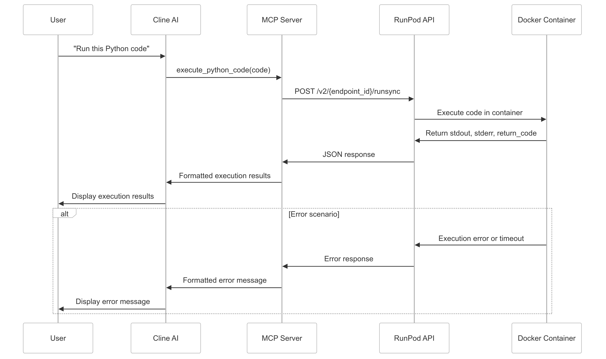
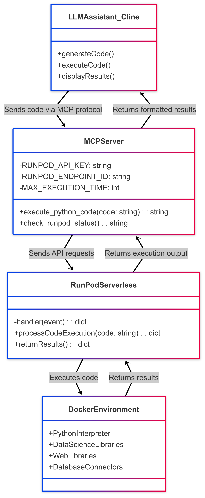
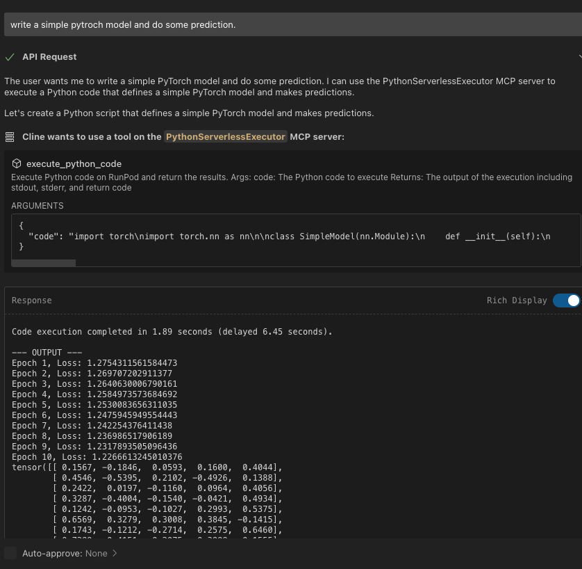

# RunPod Python Code Execution with MCP

This project enables AI assistants to execute Python code on RunPod infrastructure using the Model Context Protocol (MCP). It consists of two main components:

1. A RunPod Serverless API that executes Python code
2. An MCP server that connects to the RunPod API and provides a standardized interface for AI assistants

## System Architecture

```
┌───────────────┐     ┌───────────────┐     ┌───────────────┐
│               │     │               │     │               │
│  AI Assistant │────▶│   MCP Server  │────▶│ RunPod API    │
│  (e.g. Cline) │     │    (Python)   │     │ (Serverless)  │
│               │     │               │     │               │
└───────────────┘     └───────────────┘     └───────────────┘
```


## Interaction Sequence

## UML


## 1. RunPod Serverless Setup

### Prerequisites

- Docker installed
- RunPod account with API key
- Basic knowledge of Docker and Python

### Step 1: Build and Push Docker Image

The Dockerfile includes common data science libraries and the code handler:
current docker image: docker.io/79c2e466/code_handler_serverless
```bash
# Clone this repository
git clone https://github.com/yourusername/runpod-python-executor.git
cd runpod-python-executor

# Build the Docker image
docker build -t yourusername/runpod-python-executor:latest .

# Login to Docker Hub
docker login

# Push the image to Docker Hub
docker push yourusername/runpod-python-executor:latest
```


### Step 2: Deploy on RunPod Serverless

1. Go to [RunPod.io](https://runpod.io)
2. Navigate to Serverless → Deploy
3. Enter your Docker image URL: `docker.io/79c2e466/code_handler_serverless`
4. Configure settings:
   - Worker Type: CPU or basic GPU
   - Min/Max Workers: 1/3 (adjust based on your needs)
   - Idle Timeout: 5 minutes
5. Click "Deploy"

### Step 3: Get Endpoint ID

After deployment, RunPod will generate an endpoint ID. Copy this ID as you will need it to configure the MCP server.

Your Serverless API endpoint will be: `https://api.runpod.io/v2/{endpoint_id}/run`

You can test your endpoint using:

```bash
curl -X POST \
  https://api.runpod.io/v2/{endpoint_id}/runsync \
  -H 'Content-Type: application/json' \
  -H 'Authorization: Bearer YOUR_RUNPOD_API_KEY' \
  -d '{
    "input": {
      "code": "print(\"Hello, World!\")"
    }
  }'
```

## 2. MCP Server Setup

The MCP server connects AI assistants to your RunPod endpoint using the Model Context Protocol.

### Prerequisites

- Python 3.8+ installed
- RunPod API key
- RunPod endpoint ID from Step 3 above

### Step 1: Install Requirements
Installation
Adding MCP to your python project
We recommend using uv to manage your Python projects. In a uv managed python project, add mcp to dependencies by:

uv add "mcp[cli]"
Alternatively, for projects using pip for dependencies:

pip install mcp
Running the standalone MCP development tools
To run the mcp command with uv:

uv run mcp

```bash
pip install mcp requests
```

### Step 2: Configure the MCP Server

Create a file named `runpod_mcp_server.py` with the code from the provided template. Update the following environment variables:

```python
# Update these values
RUNPOD_API_KEY = "your_runpod_api_key"
RUNPOD_ENDPOINT_ID = "your_endpoint_id"  # From serverless deployment
```

### Step 3: Run the MCP Server

cline add mcp setting
```
"PythonServerlessExecutor": {
      "command": "xx/.local/bin/uv",
      "args": [
        "run",
        "xxx/mcp_server/runpod_serverless_mcp_server/server.py"
      ],
      "disabled": false,
      "autoApprove": []
    },
```


### Step 4: Using the MCP Server

Once connected, you can use the following tools:

- `execute_python_code`: Runs Python code on RunPod
- `check_runpod_status`: Checks the connection status with RunPod

Example usage with Cline:

```
Can you run this Python code?
```python
import numpy as np
import matplotlib.pyplot as plt

x = np.linspace(0, 10, 100)
y = np.sin(x)
plt.plot(x, y)
plt.title("Sine Wave")
plt.savefig("sine_wave.png")
print("Generated sine wave plot")
```

Cline will use the MCP server to execute this code and return the results.
## Sample


## How It Works

1. The AI assistant (like Cline) receives a request to run Python code
2. It invokes the `execute_python_code` tool via the MCP protocol
3. The MCP server sends the code to the RunPod serverless endpoint
4. RunPod executes the code in the Docker container
5. Results (stdout, stderr, return code) are returned to the MCP server
6. The MCP server formats the results and sends them back to the AI assistant
7. The AI assistant displays the results to the user

## Security Considerations

- The code execution happens in an isolated container
- Execution time is limited to prevent resource abuse
- You should implement additional security measures for production use

## Troubleshooting

- **MCP Server Connection Issues**: Check your API key and endpoint ID
- **Code Execution Timeouts**: Your code might be too complex or infinite looping
- **Missing Libraries**: Check if your code requires libraries not in the Dockerfile

## Advanced Configuration

You can modify the following to adjust behavior:

- `MAX_EXECUTION_TIME`: Change the timeout for code execution
- Dockerfile: Add or remove libraries based on your needs
- Error handling: Customize error messages for specific scenarios


## Why Serverless Instead of Pod Creation
We chose to use RunPod's serverless infrastructure rather than creating full pods for several important reasons:

1. Log Access Limitations: RunPod does not provide a direct API to retrieve logs from created pods. This makes it difficult to capture the output of code execution when using the pod creation approach.
2. Connection Complexity: Maintaining persistent connections to pods would require additional infrastructure for SSH or other remote access methods.
3. Resource Management: Pods remain running and incur charges even when idle, whereas serverless functions only charge for actual execution time.

## Cons of the Serverless Approach

1. Cold Start Latency: The first execution might experience a delay as the container spins up (cold start).
2. No Persistent Storage: Each execution starts with a fresh environment, making it difficult to maintain state between executions.
3. Resource Constraints: Serverless functions often have more limited CPU, memory, and disk allocations compared to full pods.
4.Limited GPU Access: While possible, GPU access in serverless is more limited and typically more expensive than with dedicated pods.